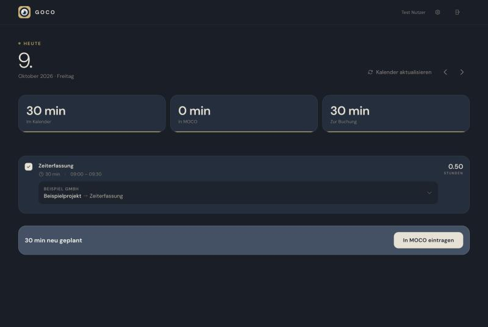
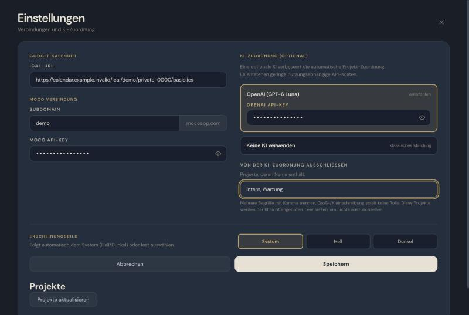

# GOCO

[](https://github.com/zoblon/GOCO/actions/workflows/ci.yml)
[](LICENSE)

🇩🇪 [Deutsche Version](README.de.md)

GOCO is a small macOS app that transfers selected Google Calendar entries to [MOCO](https://www.mocoapp.com) time tracking. It runs entirely on your Mac: a local Node.js server with a web interface that opens in your browser. The user interface is in German, aimed at MOCO users in German-speaking countries.

> **Independent project.** GOCO is not affiliated with, endorsed by or sponsored by MOCO, Google or OpenAI. All product names are trademarks of their respective owners.

## What it does

- Reads your calendar through the secret iCal address (no Google sign-in, no OAuth).
- Shows the entries of a day, groups identical titles and lets you assign each one to a MOCO project and task.
- Compares the day with the bookings that already exist in MOCO and only books what is missing. A running timer, a changed booking or an ambiguous match is reported instead of being booked blindly.
- Optionally suggests project assignments with OpenAI. Projects whose name contains configurable terms can be excluded from the AI assignment.
- Remembers your manual assignments and reuses them.




*Screenshots use synthetic sample data.*

## Requirements

- A Mac with macOS 13.5 or newer (Apple Silicon; an Intel build is attached to each release).
- A Google Calendar with its **secret address in iCal format** (Google Calendar → Settings → your calendar → *Secret address in iCal format*).
- A MOCO account and a personal **API key** (MOCO → Profile → Integrations).
- Optional: an OpenAI API key for the AI assignment.

Node.js is bundled with the app; you do not have to install anything else.

## Installation

1. Download `GOCO-<version>.zip` (Apple Silicon) or `GOCO-<version>-x64.zip` (Intel) from the [latest release](https://github.com/zoblon/GOCO/releases/latest).
2. Optional: compare the checksum with the attached `.sha256` file: `shasum -a 256 -c GOCO-<version>.zip.sha256`.
3. Unzip it and move `GOCO.app` to *Applications* (or anywhere else).

### First start

GOCO is signed ad hoc and **not notarized by Apple**, so Gatekeeper warns on the first start:

- Right-click (or Control-click) `GOCO.app` → **Open** → confirm with **Open**, or
- try to open it once, then go to *System Settings → Privacy & Security* and click **Open Anyway**.

GOCO then starts a local server and opens `http://localhost:3457` in your default browser. A short setup asks for the calendar address, the MOCO subdomain and API key, your MOCO user and, optionally, the OpenAI key.

## Usage

Open `GOCO.app` whenever you want to book time. Check the day's entries and their project assignments, then click **In MOCO eintragen**. *Kalender aktualisieren* reloads the calendar, *Projekte aktualisieren* (settings) reloads the MOCO projects. The server keeps running in the background until you log out or restart; opening the app again only opens the browser. To stop it earlier:

```bash
launchctl remove io.github.zoblon.goco.server
```

Settings and assignments live in the browser's local storage, so use the same browser every time. More detail (German): [docs/GOCO-Anleitung.md](docs/GOCO-Anleitung.md).

## Limits

- macOS only; single user per browser profile.
- Not notarized (see above). Pages are served over plain HTTP on the loopback interface.
- Time zones: the `TZID` of calendar events is ignored; times are interpreted in your Mac's time zone.
- Recurring events with a combination of `BYDAY` and `INTERVAL` may be inaccurate in edge cases.
- The AI assignment is a suggestion; always check the result before booking.
- Keys are stored unencrypted in the browser's local storage. See [PRIVACY.md](PRIVACY.md).

## Build from source

Requires macOS with the command line tools (`osacompile` and `codesign` ship with macOS) and internet access.

```bash
git clone https://github.com/zoblon/GOCO.git
cd GOCO
scripts/build-app.sh              # Apple Silicon -> dist/GOCO-<version>.zip
scripts/build-app.sh --arch x64   # Intel         -> dist/GOCO-<version>-x64.zip
```

The script compiles the applet, copies the scripts, downloads the latest official Node.js LTS from nodejs.org (override with `NODE_VERSION=24.21.0`), verifies it against `SHASUMS256.txt`, adds the licenses, signs the bundle ad hoc, runs `codesign --verify` and zips the result. The built app is in `build/GOCO.app`.

Tests (Node.js 20 or newer, no dependencies):

```bash
npm run check   # node --check for every script
npm test        # node --test
```

Run the server without building the app (port 3457; set `PORT` to use another one):

```bash
GOCO_FOREGROUND=1 node src/goco-standalone.js
```

## Project layout

```
src/      server and web app (goco-standalone.js), sync logic (goco-sync-core.js),
          MOCO adapter and booking journal (goco-sync-server.js), browser workflow (goco-workflow.js)
app/      AppleScript launcher, Info.plist, app icon (.icns)
assets/   icon artwork
scripts/  build-app.sh
test/     node:test suites
docs/     user guide (German), release notes
```

## License

[MIT](LICENSE) © 2026 Tobi Rehkopf. The app bundle ships an unmodified official Node.js binary; its license is included in the bundle (`Contents/Resources/licenses`).
